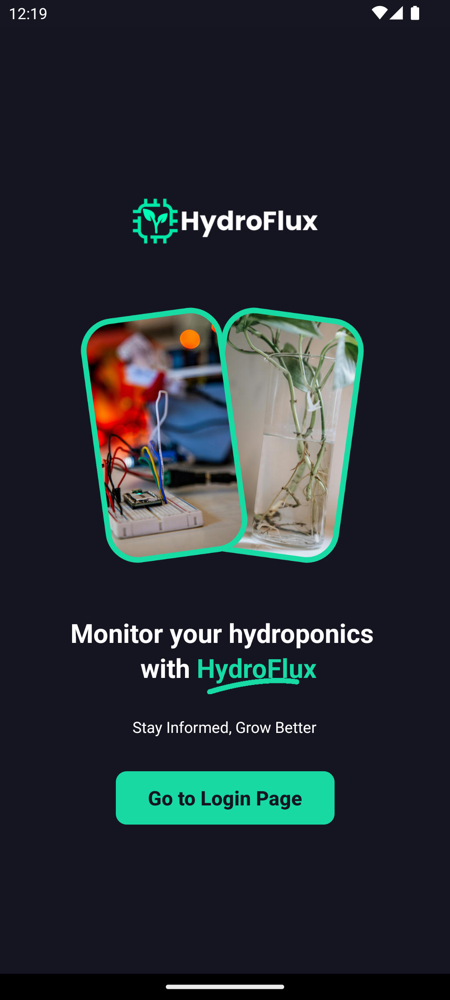

# HydroFlux

 
 

  

Hydroflux is a **React Native application** that interfaces with an **IoT-based hydroponic monitoring system**, built around **Arduino Uno** and **NodeMCU** microcontrollers equipped with sensors. It captures **real-time environmental data** and displays it on mobile devices for monitoring plant health and system performance.

## Developers
- [@Lowell0803](https://github.com/Lowell0803)
- [@jelocc](https://github.com/jelocc)

*This is in partial fulfillment of the requirements for the course subject **Thesis**, as part of the curriculum for fourth year students of the Bachelor of Science in Mathematics with Specialization in Computer Science.*

## Features & Contributions

| Section & Features                         | @Lowell0803                | @jelocc                   |
|--------------------------------------------|----------------------------|---------------------------|
| Initial Design – Pre‑redesign layout       | 
✔️
   | 
✔️
  |
| Final Design – UI/UX improvements          | 
✔️
   |                           |
| Authentication – Login & register screens  | 
✔️
   | 
✔️
  |
| Firebase Integration – REST API data push  | 
✔️
   |                           |
| Dashboard Tab – Hardware overview          | 
✔️
   |                           |
| Info Tab – Plant info & guides             | 
✔️
   | 
✔️
  |
| Plant Tab – Real‑time monitoring display   | 
✔️
   |                           |
| Stats Tab – Historical data visualization  | 
✔️
   |                           |
| Settings Tab – Diagnostics & preferences   | 
✔️
   |                           |
| Themes – Light & dark mode                 | 
✔️
   |                           |
| Static Pages – Privacy, Terms & About      |                            | 
✔️
  |

## System Screenshots

  <h3>Welcome Page</h3>
  
  

  <h3>Login Page</h3>
  
  

  <h3>Register Page</h3>
  
  

  <h3>Dashboard Tab</h3>
  
  

  <h3>Info Tab</h3>
  
  

  <h3>Plant Tab</h3>
  
  

  <h3>Statistics Tab</h3>
  
  

  <h3>Settings Tab</h3>
  
  

## Acknowledgment

Special thanks to **Byte Squad**, the original thesis group led by **Mr. Aquino**, who contributed in the research paper associated with HydroFlux. Moreover, big thanks to **Dr. Gascon** for sponsoring some of the hardware in the IoT system.

In general, **Mr. Aquino** handled the front-end with React Native, backend with Firebase, and setup of IoT system using Arduino, while **Mr. Rosal** assisted in some of the front-end elements.

## Deployment

This application was deployed in the Android operating system. Currently, the `.apk` is not available to the public. For requests, you may contact [aquino.ylt@gmail.com](mailto:aquino.ylt@gmail.com).

You can also watch the trailer in [YouTube](https://www.youtube.com/watch?v=vc7bqBwT8_Q). But do note that this uses the **pre-redesign** and **outdated** UI.

## FAQs

### 1. What are the development tools used for this project?
- The `React Native` framework is the core of this project. Moreover, `Expo Go` was used to speed up the development process. This was also coded in `VSCode`, and the version control was handled by `Git` and `GitHub`. The IoT system was coded using the `Arduino IDE`.
### 2. How do I setup the IoT system?
- The folder `iot` contains the source code for the IoT system (powered by `Arduino` and `NodeMCU`). Furthermore, the connectivity diagram is shown below. It is also recommended that you read the IMRaD for our research once it's available.

    

### 3. Where is the IMRaD located?
- Check the repository for the `.pdf` file. If you can't find it, it may have been deleted or is not yet available.
### 4. Is this the actual repository used in the project?
- No. This is a meta repository intended for public viewing and documentation purposes only. It does not contain the complete or production-ready source code.
### 5. How can I run the full system?
- This meta repository does not include all the components necessary to run the system. If you require access to the full implementation (for academic or research purposes), please contact the main developer below.

## Feedback

If you have any feedback/comment/request, please reach out to [aquino.ylt@gmail.com](mailto:aquino.ylt@gmail.com).

### Thank you and God bless!
